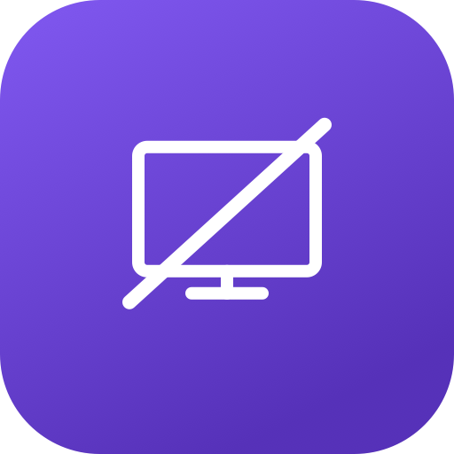

<p align="center">
  
</p>

<h1 align="center">Headless Helper</h1>

<p align="center">
  <strong>Voice-guided remote control for headless Mac</strong><br>
  Manage AirPlay screen mirroring and WiFi connections without a monitor
</p>

<p align="center">
  
  
  
</p>

---

## What is this?

**Headless Helper** is a macOS menu bar utility for Mac computers running without a display. It automates two tasks that are normally impossible without a screen:

- **AirPlay Mirroring** — discover Apple TV devices and start full-screen mirroring
- **WiFi Management** — scan networks, connect, and handle password entry

Everything is accessible via **global hotkeys** and **voice feedback** — no display required.

## Features

### AirPlay Screen Mirroring
- Discovers Apple TV devices on the local network via Bonjour
- Filters to display-capable devices only (excludes HomePod, Mac)
- Connects through Control Center UI automation
- Automatically selects "Entire Screen" mirroring mode
- Handles PIN code entry when required
- Detects if already connected and avoids duplicate connections

### WiFi Network Management
- Scans available WiFi networks through Control Center
- Shows signal strength and security status
- Connects to selected networks automatically
- Monitors password dialog for errors ("Connection failed", wrong password)
- Verifies connection via network interface status

### Accessibility-First Design
- **Global hotkeys** work from any app, no display needed
- **Voice feedback** for every action — device lists, status, errors
- **Numbered selection** — press a digit to choose (supports two-digit numbers)
- Works entirely without seeing the screen

## Hotkeys

| Shortcut | Action |
|----------|--------|
| `⌃⌥M` | Scan AirPlay devices and connect |
| `⌃⌥W` | Scan WiFi networks and connect |
| `1`–`99` | Select device/network by number |
| `Escape` | Cancel selection |

## Installation

### Build from source

Requires macOS 14+ and Xcode Command Line Tools.

```bash
git clone https://github.com/AlexLuzik/headless-helper.git
cd HeadlessHelper
chmod +x build.sh
./build.sh
```

### Install

```bash
cp -r HeadlessHelper.app /Applications/
```

### First launch

1. Open `HeadlessHelper.app`
2. Grant **Accessibility** permission when prompted (System Settings → Privacy & Security → Accessibility)
3. The app will automatically restart after permission is granted
4. The menu bar icon (crossed-out monitor) appears — you're ready

## Usage

### Via Menu Bar
Click the menu bar icon to see:
- Available AirPlay devices (numbered)
- WiFi networks (click "Scan WiFi Networks" first)
- Settings and About

### Via Hotkeys (headless mode)

**Connect to Apple TV:**
1. Press `⌃⌥M`
2. Voice announces available devices: *"1, Living Room. 2, Bedroom."*
3. Press `1` to connect
4. Voice confirms: *"Connected."*

**Connect to WiFi:**
1. Press `⌃⌥W`
2. Voice announces available networks: *"1, HomeWiFi, connected, secure. 2, GuestNetwork, secure."*
3. Press `2` to connect
4. If password needed, voice says: *"Enter WiFi password."* — type it in the system dialog
5. Voice confirms connection or reads error

## How it works

Headless Helper automates macOS Control Center through the **Accessibility API** (AXUIElement). It:

1. Opens Control Center programmatically
2. Navigates to Screen Mirroring or WiFi panel
3. Reads available devices/networks from the UI
4. Clicks to connect
5. Handles system dialogs (PIN entry, content picker, WiFi password)
6. The ScreenCaptureKit content picker (which is not accessible via AX) is automated by finding its window via `CGWindowListCopyWindowInfo` and clicking buttons through a child process

## Requirements

- **macOS 14 (Sonoma)** or later
- **Accessibility permission** — required for Control Center automation and global hotkeys
- **AirPlay devices** on the same network (for mirroring feature)

## Settings

Access via menu bar → Settings:
- **Launch at login**
- **Auto-connect to last AirPlay device on launch**
- **Language** — English / Ukrainian
- **Global hotkey** customization

## Languages

- English
- Ukrainian (Українська)

## Built with AI

This project was fully vibe-coded — designed, architected, and written entirely through human-AI collaboration. Every line of code was generated via natural language conversation, proving that complex macOS system-level apps can be built without writing code by hand.

## Credits

- Developed by [Oleksandr Luzin](https://luzin.cc)
- Inspired by [headless-airplay-screen-mirror](https://github.com/TylerBoni/headless-airplay-screen-mirror) by Tyler Boni

## License

[MIT License](LICENSE) — Copyright (c) 2026 Oleksandr Luzin
